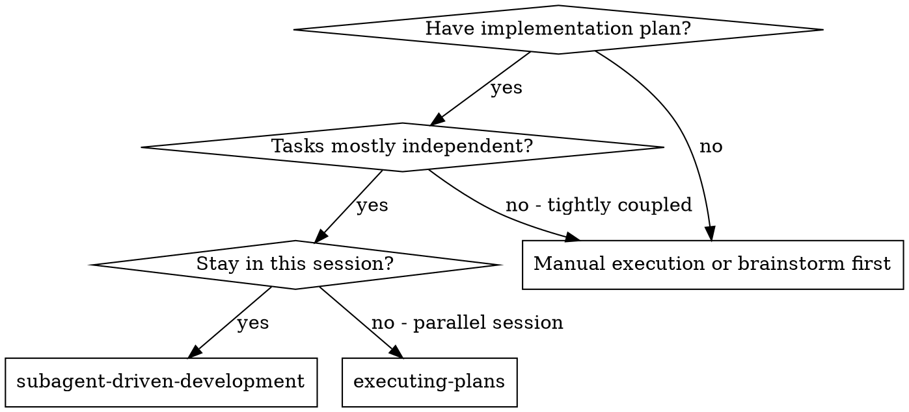
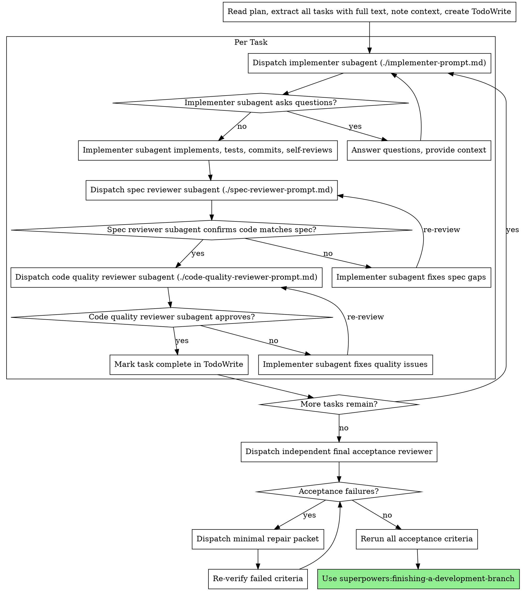

# Subagent-Driven Development

Execute plan by dispatching fresh subagent per task, with two-stage review after each: spec compliance review first, then code quality review.

**Why subagents:** You delegate tasks to specialized agents with isolated context. By precisely crafting their instructions and context, you ensure they stay focused and succeed at their task. They should never inherit your session's context or history — you construct exactly what they need. This also preserves your own context for coordination work.

**Core principle:** Fresh subagent per task + two-stage review (spec then quality) = high quality, fast iteration

**Continuous execution:** Do not pause to check in with your human partner between tasks. Execute all tasks from the plan without stopping. The only reasons to stop are: BLOCKED status you cannot resolve, ambiguity that genuinely prevents progress, or all tasks complete. "Should I continue?" prompts and progress summaries waste their time — they asked you to execute the plan, so execute it.

## When to Use



**vs. Executing Plans (parallel session):**
- Same session (no context switch)
- Fresh subagent per task (no context pollution)
- Two-stage review after each task: spec compliance first, then code quality
- Faster iteration (no human-in-loop between tasks)

## The Process

### Stage Context Setup

Read the plan header to obtain the single-file Spec path. Resolve `spec-sections` relative to the brainstorming skill directory, then extract only the Implementation Spec:

```bash
SPEC_SECTIONS="<brainstorming-skill-directory>/spec-sections"
LEGACY_POLICY="${SUPERPOWERS_SPEC_LEGACY_POLICY:-reject}"
# Equivalent CLI: spec-sections implementation <spec>
"$SPEC_SECTIONS" --legacy "$LEGACY_POLICY" implementation "$SPEC_PATH" > /tmp/implementation-spec.md
BASE_SHA=$(git rev-parse HEAD)
```

Read the plan and `/tmp/implementation-spec.md` once. Record `BASE_SHA` before dispatching implementation. Do not read the original spec. Initial implementer subagents receive their full task plus only the relevant extracted Implementation Spec sections. Acceptance content is not implementation context.

**Dispatch unit:** A subagent task is one plan task section such as `### Task N: ...`, including all checkbox steps inside it. Checkbox steps are TDD execution checkpoints, not subagent boundaries. Do not dispatch separate subagents or separate review cycles for "write failing test", "run it", "implement", "run tests", "commit", docs, or wiring steps that belong to the same plan task.

Per-task spec compliance reviews compare the task diff to the relevant Implementation Spec sections. They are not Acceptance execution and must not expose the Acceptance region to the implementer.



### Independent Acceptance and Repair Loop

After all implementation tasks and code-quality reviews:

1. Run `spec-sections implementation "$SPEC_PATH"` and `spec-sections acceptance "$SPEC_PATH"` into separate temporary files. Both commands validate before output.
2. Dispatch an independent acceptance reviewer using the requesting-code-review template. Provide context in this exact order: complete Implementation Spec, complete Acceptance contract, implementation diff, test results.
3. Require PASS, FAIL, or NOT VERIFIED plus required evidence for every Acceptance Criterion and every Rollout Acceptance check.
4. If criteria fail, build `repair-prompt.md` using only the failed criteria, their failure evidence, the Implementation Spec sections those criteria reference, and the related implementation diff.
5. Previously passed criteria remain closed unless the repair changes their referenced design area or evidence shows a regression.
6. Re-verify the failed criteria after each repair. Do not send the complete Acceptance region to the repair agent.
7. When no failed criteria remain, perform final acceptance from fresh extractions of both complete regions, rerun every Acceptance Criterion, and rerun every Rollout Acceptance check. Only an all-PASS result may finish the workflow.

## Model Selection

Use the least powerful model that can handle each role to conserve cost and increase speed.

**Mechanical implementation tasks** (isolated functions, clear specs, 1-2 files): use a fast, cheap model. Most implementation tasks are mechanical when the plan is well-specified.

**Integration and judgment tasks** (multi-file coordination, pattern matching, debugging): use a standard model.

**Architecture, design, and review tasks**: use the most capable available model.

**Task complexity signals:**
- Touches 1-2 files with a complete spec → cheap model
- Touches multiple files with integration concerns → standard model
- Requires design judgment or broad codebase understanding → most capable model

## Handling Implementer Status

Implementer subagents report one of four statuses. Handle each appropriately:

**DONE:** Proceed to spec compliance review.

**DONE_WITH_CONCERNS:** The implementer completed the work but flagged doubts. Read the concerns before proceeding. If the concerns are about correctness or scope, address them before review. If they're observations (e.g., "this file is getting large"), note them and proceed to review.

**NEEDS_CONTEXT:** The implementer needs information that wasn't provided. Provide the missing context and re-dispatch.

**BLOCKED:** The implementer cannot complete the task. Assess the blocker:
1. If it's a context problem, provide more context and re-dispatch with the same model
2. If the task requires more reasoning, re-dispatch with a more capable model
3. If the task is too large, break it into smaller pieces
4. If the plan itself is wrong, escalate to the human

**Never** ignore an escalation or force the same model to retry without changes. If the implementer said it's stuck, something needs to change.

## Prompt Templates

- `./implementer-prompt.md` - Dispatch implementer subagent
- `./spec-reviewer-prompt.md` - Dispatch spec compliance reviewer subagent
- `./code-quality-reviewer-prompt.md` - Dispatch code quality reviewer subagent
- `./repair-prompt.md` - Dispatch minimal-context repairs for failed Acceptance Criteria

## Example Workflow

```
You: I'm using Subagent-Driven Development to execute this plan.

[Read plan file once: docs/superpowers/plans/feature-plan.md]
[Extract Implementation Spec only with spec-sections]
[Extract all 5 `### Task N` sections with full text and context; keep checkbox steps inside their parent task]
[Create TodoWrite with all tasks]

Task 1: Hook installation script

[Get Task 1 text and context (already extracted)]
[Dispatch implementation subagent with full task text + context]

Implementer: "Before I begin - should the hook be installed at user or system level?"

You: "User level (~/.config/superpowers/hooks/)"

Implementer: "Got it. Implementing now..."
[Later] Implementer:
  - Implemented install-hook command
  - Added tests, 5/5 passing
  - Self-review: Found I missed --force flag, added it
  - Committed

[Dispatch spec compliance reviewer]
Spec reviewer: ✅ Spec compliant - all requirements met, nothing extra

[Get git SHAs, dispatch code quality reviewer]
Code reviewer: Strengths: Good test coverage, clean. Issues: None. Approved.

[Mark Task 1 complete]

Task 2: Recovery modes

[Get Task 2 text and context (already extracted)]
[Dispatch implementation subagent with full task text + context]

Implementer: [No questions, proceeds]
Implementer:
  - Added verify/repair modes
  - 8/8 tests passing
  - Self-review: All good
  - Committed

[Dispatch spec compliance reviewer]
Spec reviewer: ❌ Issues:
  - Missing: Progress reporting (spec says "report every 100 items")
  - Extra: Added --json flag (not requested)

[Implementer fixes issues]
Implementer: Removed --json flag, added progress reporting

[Spec reviewer reviews again]
Spec reviewer: ✅ Spec compliant now

[Dispatch code quality reviewer]
Code reviewer: Strengths: Solid. Issues (Important): Magic number (100)

[Implementer fixes]
Implementer: Extracted PROGRESS_INTERVAL constant

[Code reviewer reviews again]
Code reviewer: ✅ Approved

[Mark Task 2 complete]

...

[After all tasks]
[Extract complete Implementation Spec and Acceptance regions separately]
[Dispatch independent acceptance reviewer with Design → Acceptance → Diff → Tests]
Acceptance reviewer: AC-01..AC-08 PASS with required evidence
[Freshly extract both complete regions and rerun every AC]
Final acceptance: all criteria PASS, ready to finish

Done!
```

## Advantages

**vs. Manual execution:**
- Subagents follow TDD naturally
- Fresh context per task (no confusion)
- Parallel-safe (subagents don't interfere)
- Subagent can ask questions (before AND during work)

**vs. Executing Plans:**
- Same session (no handoff)
- Continuous progress (no waiting)
- Review checkpoints automatic

**Efficiency gains:**
- No file reading overhead (controller provides full text)
- Controller curates exactly what context is needed
- Subagent gets complete information upfront
- Questions surfaced before work begins (not after)

**Quality gates:**
- Self-review catches issues before handoff
- Two-stage review: spec compliance, then code quality
- Review loops ensure fixes actually work
- Spec compliance prevents over/under-building
- Code quality ensures implementation is well-built

**Cost:**
- More subagent invocations (implementer + 2 reviewers per task)
- Controller does more prep work (extracting all tasks upfront)
- Review loops add iterations
- But catches issues early (cheaper than debugging later)

## Red Flags

**Never:**
- Start implementation on main/master branch without explicit user consent
- Skip reviews (spec compliance OR code quality)
- Proceed with unfixed issues
- Dispatch multiple implementation subagents in parallel (conflicts)
- Make subagent read plan file (provide full text instead)
- Treat checkbox steps inside a task as separate subagent tasks or review boundaries
- Skip scene-setting context (subagent needs to understand where task fits)
- Ignore subagent questions (answer before letting them proceed)
- Accept "close enough" on spec compliance (spec reviewer found issues = not done)
- Skip review loops (reviewer found issues = implementer fixes = review again)
- Let implementer self-review replace actual review (both are needed)
- **Start code quality review before spec compliance is ✅** (wrong order)
- Move to next task while either review has open issues
- Read the original single-file spec during initial implementation
- Send Acceptance Criteria to an initial implementer
- Repair from the complete Acceptance region when a failed-criterion packet is sufficient
- Finish after partial re-verification without a fresh full final acceptance

**If subagent asks questions:**
- Answer clearly and completely
- Provide additional context if needed
- Don't rush them into implementation

**If reviewer finds issues:**
- Implementer (same subagent) fixes them
- Reviewer reviews again
- Repeat until approved
- Don't skip the re-review

**If subagent fails task:**
- Dispatch fix subagent with specific instructions
- Don't try to fix manually (context pollution)

## Integration

**Required workflow skills:**
- **superpowers:using-git-worktrees** - Ensures isolated workspace (creates one or verifies existing)
- **superpowers:writing-plans** - Creates the plan this skill executes
- **superpowers:requesting-code-review** - Code review template for reviewer subagents
- **superpowers:finishing-a-development-branch** - Complete development after all tasks

**Subagents should use:**
- **superpowers:test-driven-development** - Subagents follow TDD for each task

**Alternative workflow:**
- **superpowers:executing-plans** - Use for parallel session instead of same-session execution
